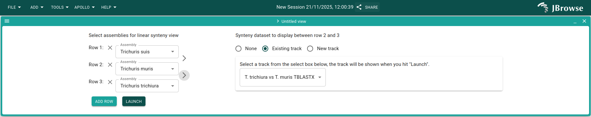

<!-- vim-markdown-toc GFM -->

* [Setup required programs](#setup-required-programs)
* [Prepare reference genomes for syntheny](#prepare-reference-genomes-for-syntheny)
* [Prepare syntheny tracks](#prepare-syntheny-tracks)
* [Prepare reference annotation](#prepare-reference-annotation)
* [Prepare reference for Apollo](#prepare-reference-for-apollo)
* [Setup local Apollo](#setup-local-apollo)
* [Loading reference](#loading-reference)

<!-- vim-markdown-toc -->

# Setup required programs

```
conda create -n apollo-synteny-example
conda activate apollo-synteny-example
conda install --yes --file requirements.txt -n apollo-synteny-example
```

Copy ISOseq file where JBrowse will be able to find it:

```
mkdir -p jbrowse_data
cp isoseq/TTRE_all_isoseq.chr2.bam isoseq/TTRE_all_isoseq.chr2.bam.bai jbrowse_data/
```

# Prepare reference genomes for syntheny

*NB:* For the syntheny tracks we use the masked genomes since they improve
blast performance.

```
mkdir -p blast
cd blast

curl -O -L https://ftp.ebi.ac.uk/pub/databases/wormbase/parasite/releases/WBPS19/species/trichuris_suis/PRJNA179528/trichuris_suis.PRJNA179528.WBPS19.genomic_masked.fa.gz
curl -O -L https://ftp.ebi.ac.uk/pub/databases/wormbase/parasite/releases/WBPS19/species/trichuris_muris/PRJEB126/trichuris_muris.PRJEB126.WBPS19.genomic_masked.fa.gz
curl -O -L https://ftp.ebi.ac.uk/pub/databases/wormbase/parasite/releases/WBPS19/species/trichuris_trichiura/PRJEB535/trichuris_trichiura.PRJEB535.WBPS19.genomic_masked.fa.gz

gunzip trichuris_suis.PRJNA179528.WBPS19.genomic_masked.fa.gz trichuris_muris.PRJEB126.WBPS19.genomic_masked.fa.gz trichuris_trichiura.PRJEB535.WBPS19.genomic_masked.fa.gz 
cd -
```

# Prepare syntheny tracks

Prepare blast database for *T. muris*, only for chromsome TMUE_LG2:

```
samtools faidx blast/trichuris_muris.PRJEB126.WBPS19.genomic_masked.fa TMUE_LG2 > blast/TMUE_LG2.fa
makeblastdb -in blast/TMUE_LG2.fa -dbtype nucl
```

To speed up the process, from the query species extract the regions of interest and blast only those:

```
samtools faidx blast/trichuris_trichiura.PRJEB535.WBPS19.genomic_masked.fa TTRE_chr2:22197000-22222000 \
| sed 's/:.*//' > blast/TTRE_chr2.fa

samtools faidx blast/trichuris_suis.PRJNA179528.WBPS19.genomic_masked.fa T_suis-1.0_Cont18:283800-309000 \
|  sed 's/:.*//' > blast/T_suis-1.0_Cont18.fa
```

Run tblastx and process the blast output to:

* Increase the query coordinates and query length to make them consistent with
  the whole contig. This is because the query is only a part of the contig. You
  can get the contig length from the second column of the .fai index

* Exclude hits with percentage identity (pident) lower than a threshold (50).

* Reformat blast tabular output to paf format.

```
BLAST_FMT='qaccver qlen qstart qend sstrand saccver slen sstart send nident pident'
EVALUE=0.01
PIDENT=50

tblastx -query blast/TTRE_chr2.fa \
           -db blast/TMUE_LG2.fa \
           -evalue $EVALUE \
           -max_target_seqs 10 \
           -outfmt "6 ${BLAST_FMT}" \
| awk -v offset=22197000 -v qlen=29164577 -v pident=$PIDENT -v OFS='\t' '$11 > pident {$2=qlen; $3=$3+offset-1; $4=$4+offset-1; print}' \
| ./scripts/blast2paf.py > jbrowse_data/TTRE_chr2_vs_TMUE_LG2.paf

tblastx -query blast/T_suis-1.0_Cont18.fa \
           -db blast/TMUE_LG2.fa \
           -evalue $EVALUE \
           -max_target_seqs 10 \
           -outfmt "6 ${BLAST_FMT}" \
| awk -v offset=283800 -v qlen=1155537 -v pident=$PIDENT -v OFS='\t' '$11 > pident {$2=qlen; $3=$3+offset-1; $4=$4+offset-1; print}' \
| ./scripts/blast2paf.py > jbrowse_data/T_suis-1.0_Cont18_vs_TMUE_LG2.paf
```

# Prepare reference annotation

Get gff3 files and remove non-CDS records with the same ID

```
for url in \
    https://ftp.ebi.ac.uk/pub/databases/wormbase/parasite/releases/WBPS19/species/trichuris_suis/PRJNA179528/trichuris_suis.PRJNA179528.WBPS19.annotations.gff3.gz \
    https://ftp.ebi.ac.uk/pub/databases/wormbase/parasite/releases/WBPS19/species/trichuris_muris/PRJEB126/trichuris_muris.PRJEB126.WBPS19.annotations.gff3.gz \
    https://ftp.ebi.ac.uk/pub/databases/wormbase/parasite/releases/WBPS19/species/trichuris_trichiura/PRJEB535/trichuris_trichiura.PRJEB535.WBPS19.annotations.gff3.gz
do
    gff=`basename $url .gz`
    curl $url \
    | zcat \
    | grep -P '\tCDS\t|\texon\t|\tgene\t|\tmRNA\t|\tprotein_coding_primary_transcript\t|\trRNA\t|\tsnRNA\t|\ttRNA\t|\tnontranslating_CDS\t|\tfive_prime_UTR\t|\tthree_prime_UTR\t|^##' > jbrowse_data/$gff
done
```

# Prepare reference for Apollo

Prepare reference for Apollo:

```
mkdir -p data

for url in https://ftp.ebi.ac.uk/pub/databases/wormbase/parasite/releases/WBPS19/species/trichuris_suis/PRJNA179528/trichuris_suis.PRJNA179528.WBPS19.genomic_softmasked.fa.gz \
           https://ftp.ebi.ac.uk/pub/databases/wormbase/parasite/releases/WBPS19/species/trichuris_muris/PRJEB126/trichuris_muris.PRJEB126.WBPS19.genomic_softmasked.fa.gz \
           https://ftp.ebi.ac.uk/pub/databases/wormbase/parasite/releases/WBPS19/species/trichuris_trichiura/PRJEB535/trichuris_trichiura.PRJEB535.WBPS19.genomic_softmasked.fa.gz
do
    fa=`basename $url .gz`
    curl $url | zcat > data/${fa}
    bgzip data/${fa}
    samtools faidx data/${fa}.gz
done
```

# Setup local Apollo

See the official Apollo documentation to setup a [local
demo](https://apollo.jbrowse.org/docs/try-it-out/local-demo/setting-up).
Assuming you have `docker` and `docker compose` available on your system, the
instructions here below should suffice but they may be out of date.

Start Apollo

```
docker compose up
```

Install the Apollo and jbrowse command line tools (see the Apollo documentation
for alternatives to `npm`):

```
npm install -g @apollo-annotation/cli @jbrowse/cli
```

Check installation and version. At the time of this writing we are using:

```
apollo --version
@apollo-annotation/cli/0.3.9 linux-x64 node-v24.2.0
jbrowse --version
@jbrowse/cli version 3.7.0
```

Configure access to Apollo:

```
apollo config address http://localhost/apollo
apollo config accessType root
apollo config rootPassword password
apollo login
```

# Loading reference

```
for x in data/trichuris_muris.PRJEB126.WBPS19.genomic_softmasked.fa.gz \
    data/trichuris_suis.PRJNA179528.WBPS19.genomic_softmasked.fa.gz \
    data/trichuris_trichiura.PRJEB535.WBPS19.genomic_softmasked.fa.gz
do
    asm=`basename $x`
    asm=${asm/.*/}
    asm=${asm/_/ }
    asm=${asm/t/T}

    apollo assembly \
      add-from-fasta \
      $x \
      --fai $x.fai \
      --gzi $x.gzi \
      --assembly "${asm}"
done
```

Add evidence tracks. First get the ID of the assemblies, then assign the GFF,
syntheny and ISOseq files to the corresponding assembly IDs.


```
MURIS_ID=$(
  apollo assembly get |
    jq --raw-output '.[] | select(.name=="Trichuris muris")._id'
)
SUIS_ID=$(
  apollo assembly get |
    jq --raw-output '.[] | select(.name=="Trichuris suis")._id'
)
TRICHIURA_ID=$(
  apollo assembly get |
    jq --raw-output '.[] | select(.name=="Trichuris trichiura")._id'
)
```

We get the jbrowse configuration file, edit it, and reload it. *NB*: The evidence
tracks *must be* in directory `jbrowse_data` for JBrowse to find them, but note
that the paths to file in `jbrowse add-track` commands are `data/...`.

```
apollo jbrowse get-config > data/config.json

jbrowse add-track \
  data/T_suis-1.0_Cont18_vs_TMUE_LG2.paf \
  --load inPlace \
  --name "T. suis vs T. muris TBLASTX" \
  --assemblyNames "${SUIS_ID}","${MURIS_ID}" \
  --force \
  --out data/config.json

jbrowse add-track \
  data/TTRE_chr2_vs_TMUE_LG2.paf \
  --load inPlace \
  --name "T. trichiura vs T. muris TBLASTX" \
  --assemblyNames "${TRICHIURA_ID}","${MURIS_ID}" \
  --force \
  --out data/config.json

## GFF Annotation
jbrowse add-track \
  data/trichuris_muris.PRJEB126.WBPS19.annotations.gff3 \
  --load inPlace \
  --name "T. muris GFF3" \
  --assemblyNames "${MURIS_ID}" \
  --force \
  --out data/config.json

jbrowse add-track \
  data/trichuris_suis.PRJNA179528.WBPS19.annotations.gff3 \
  --load inPlace \
  --name "T. suis GFF3" \
  --assemblyNames "${SUIS_ID}" \
  --force \
  --out data/config.json

jbrowse add-track \
  data/trichuris_trichiura.PRJEB535.WBPS19.annotations.gff3 \
  --load inPlace \
  --name "T. trichiura GFF3" \
  --assemblyNames "${TRICHIURA_ID}" \
  --force \
  --out data/config.json

## Evidence bam
jbrowse add-track \
  data/TTRE_all_isoseq.chr2.bam \
  --load inPlace \
  --name "T. trichiura ISOseq" \
  --assemblyNames "${TRICHIURA_ID}" \
  --force \
  --out data/config.json

apollo jbrowse set-config data/config.json
rm data/config.json
```

On your web browser navigate to http://localhost, login as Guest, then:

* From drop down menu select *Linear syntheny view*, then click *Launch view*

* Fill-in the syntheny form and click launch once done, it should look like:



* Navigate to region (`[rev]` instructs Apollo to show this track in reverse):

```
T_suis-1.0_Cont18:290236-302715
TMUE_LG2:26024030-26036509
TTRE_chr2:22203142-22215620[rev]
```

* For each track, click on *Open track selector* and the GFF3 track. For *T.
  trichiura*, click also on the ISOseq track. The view should look like:


