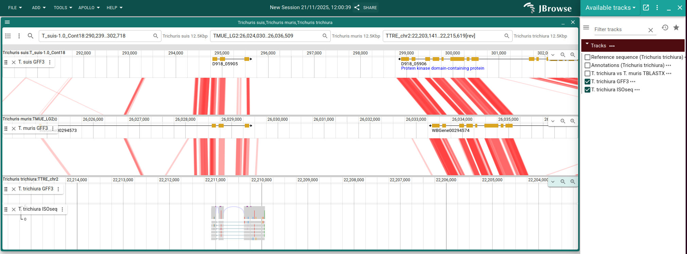

<!-- vim-markdown-toc GFM -->

* [Setup local Apollo](#setup-local-apollo)
* [Loading reference](#loading-reference)
* [Visualise tracks](#visualise-tracks)
* [Loading to Apollo staging server](#loading-to-apollo-staging-server)

<!-- vim-markdown-toc -->

# Setup local Apollo

See the official Apollo documentation to setup a [local
demo](https://apollo.jbrowse.org/docs/try-it-out/local-demo/setting-up).
Assuming you have `docker` and `docker compose` available on your system, the
instructions here below should suffice but they may be out of date.

Start Apollo

```
docker compose up
```

Install the Apollo and jbrowse command line tools (see the Apollo documentation
for alternatives to `npm`):

```
npm install -g @apollo-annotation/cli @jbrowse/cli
```

Check installation and version. At the time of this writing we are using:

```
apollo --version
@apollo-annotation/cli/0.3.9 linux-x64 node-v24.2.0
jbrowse --version
@jbrowse/cli version 3.7.0
```

Configure access to Apollo:

```
apollo config address http://localhost/apollo
apollo config accessType root
apollo config rootPassword password
apollo login
```

# Loading reference

```
for x in data/trichuris_muris.PRJEB126.WBPS19.genomic_softmasked.fa.gz \
    data/trichuris_suis.PRJNA179528.WBPS19.genomic_softmasked.fa.gz \
    data/trichuris_trichiura.PRJEB535.WBPS19.genomic_softmasked.fa.gz
do
    asm=`basename $x`
    asm=${asm/.*/}
    asm=${asm/_/ }
    asm=${asm/t/T}

    apollo assembly \
      add-from-fasta \
      $x \
      --fai $x.fai \
      --gzi $x.gzi \
      --assembly "${asm}"
done
```

Add evidence tracks. First get the ID of the assemblies, then assign the GFF,
syntheny and ISOseq files to the corresponding assembly IDs.


```
MURIS_ID=$(
  apollo assembly get |
    jq --raw-output '.[] | select(.name=="Trichuris muris")._id'
)
SUIS_ID=$(
  apollo assembly get |
    jq --raw-output '.[] | select(.name=="Trichuris suis")._id'
)
TRICHIURA_ID=$(
  apollo assembly get |
    jq --raw-output '.[] | select(.name=="Trichuris trichiura")._id'
)
```

We get the jbrowse configuration file, edit it, and reload it. *NB*: The evidence
tracks *must be* in directory `jbrowse_data` for JBrowse to find them, but note
that the paths to file in `jbrowse add-track` commands are `data/...`.

```
apollo jbrowse get-config > data/config.json

jbrowse add-track \
  data/T_suis-1.0_Cont18_vs_TMUE_LG2.paf \
  --load inPlace \
  --name "T. suis vs T. muris TBLASTX" \
  --assemblyNames "${SUIS_ID}","${MURIS_ID}" \
  --force \
  --out data/config.json

jbrowse add-track \
  data/TTRE_chr2_vs_TMUE_LG2.paf \
  --load inPlace \
  --name "T. trichiura vs T. muris TBLASTX" \
  --assemblyNames "${TRICHIURA_ID}","${MURIS_ID}" \
  --force \
  --out data/config.json

## GFF Annotation
jbrowse add-track \
  data/trichuris_muris.PRJEB126.WBPS19.annotations.gff3 \
  --load inPlace \
  --name "T. muris GFF3" \
  --assemblyNames "${MURIS_ID}" \
  --force \
  --out data/config.json

jbrowse add-track \
  data/trichuris_suis.PRJNA179528.WBPS19.annotations.gff3 \
  --load inPlace \
  --name "T. suis GFF3" \
  --assemblyNames "${SUIS_ID}" \
  --force \
  --out data/config.json

jbrowse add-track \
  data/trichuris_trichiura.PRJEB535.WBPS19.annotations.gff3 \
  --load inPlace \
  --name "T. trichiura GFF3" \
  --assemblyNames "${TRICHIURA_ID}" \
  --force \
  --out data/config.json

## Evidence bam
jbrowse add-track \
  data/TTRE_all_isoseq.chr2.bam \
  --load inPlace \
  --name "T. trichiura ISOseq" \
  --assemblyNames "${TRICHIURA_ID}" \
  --force \
  --out data/config.json

apollo jbrowse set-config data/config.json
rm data/config.json
```

# Visualise tracks

On your web browser navigate to http://localhost, login as Guest, then:

* From drop down menu select *Linear syntheny view*, then click *Launch view*

* Fill-in the syntheny form and click launch once done, it should look like:


* Navigate to region (`[rev]` instructs Apollo to show this track in reverse):

```
T_suis-1.0_Cont18:290236-302715
TMUE_LG2:26024030-26036509
TTRE_chr2:22203142-22215620[rev]
```

* For each track, click on *Open track selector* and the GFF3 track. For *T.
  trichiura*, click also on the ISOseq track. The view should look like:



# Loading to Apollo staging server

See [load demo server](load_demo_server.md)

